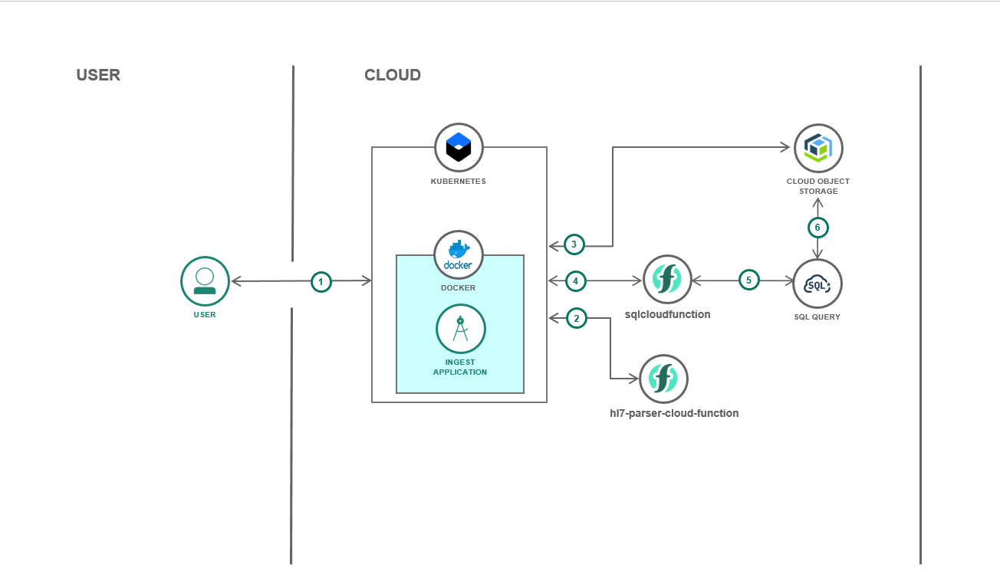
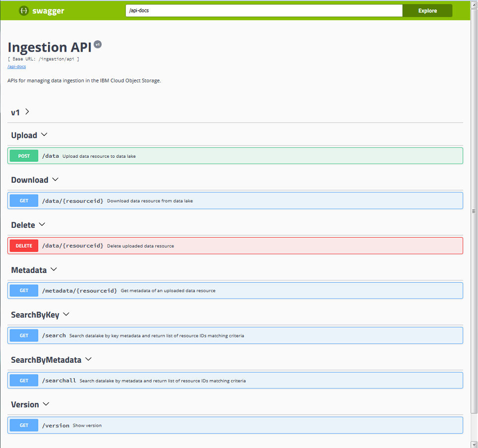

# REST APIs to ingest and search documents on IBM Cloud Object Storage 

## Overview
REST APIs to ingest and retrieve stored documents in a simple Node.js application, the application uses the IBM Object Storage service available on IBM Cloud and is deployed on top of the container orchestration platform Kubernetes. Documents are parsed and validated using an external cloud function: hl7parsercloudfunction. Two types of searches are available, one by keys and one by metadata using the IBM SQL Query service.  

## Description
This application uses the IBM Cloud Object Storage, a highly scalable cloud storage service, and to interact with it we have included the *ibm-cos-sdk* for node.js, which provides the same S3 APIs as AWS Cloud Storage.
Two buckets have been defined as folders, one to store the objects and another one to store metadata as JSON files. The metadata bucket is used to search documents by their metadata through the IBM SQL Query Service.
In each operation on the storage the transactionality is guaranteed using the metadata object as master. 
The resource key is built using the following concatenation of metadata: *tenantid-sourceid-subjectid-timecreated-uuid*. 
The REST APIs available with this application are:
- *postData* : executes the objects upload. On the base of the content type defined as input parameter, the application first validates the input document using the configured parser cloud function (for this first release the hl7parser cloud function has been used). The parser returns with validation result and a subset of metadata extracted form the documents. Object and metadata are stored into separate bucket but with the same resource key.
- *searchByKey* : implements the fast search by the prefix *tenantid-sourceid-subjectid* directly using the S3 APIs.
- *searchByMetadata* :  implements the extended search by metadata. It is possible to define one or more metadata values as query parameters, they are put in AND and used to build the query that is run on the metadata bucket invoking the
external cloud function: sqlcloudfunction.
- *getMetadata* : retrieves metadata stored as JSON file. 
- *getData* : retrieves the object content.
- *deleteData* :  deletes the objects from the two buckets.
- *getVersion* : to get the release version.


## Flow



1. The external application invokes ingestion REST APIs 
2. In case of upload request with content type hl7, the application invokes the hl7parser cloud function to validate and extract metadata from the input HL7 document
3. The application accesses the Cloud Object Storage instance to store valid documents, get document metadata, content and search by key.  
4. To search by metadata the sqlcloud function is invoked.
5. The sqlcloudfunction runs sql statements using the SQL Query service.
6. The SQL Query service interacts with Cloud Object Storage to retrieve results.


## Preliminary Steps

### 1. Create and configure a Cloud Object Storage service instance
Sign up for an IBM Cloud account. Once registered, add an [IBM Cloud Object Storage service](https://console.bluemix.net/catalog/services/cloud-object-storage). 

In the IBM Cloud Object Storage UI:

- create two buckets (these are "folders" where uploaded files will be kept) one to store objects and another to store metadata as json file.
- create a set of credentials. 
Make a note of the bucket names, API end-point and API key for the next step.

### 2. Create a SQL Query service instance

 Follow instructions to create an [SQLQuery instance](https://console.bluemix.net/docs/services/sql-query/getting-started.html#getting-started-tutorial)

### 3. Build and publish hl7parser cloud function
Follow instructions for [hl7-parser-cloud-function](https://github.com/IBM/hl7-parser-cloud-function)

### 4. Build and publish SQL cloud function
Follow instructions for [sqlcloudfunction](https://github.com/IBM-Cloud/sql-query-clients/tree/master/Python/cloud_function)
Make a note of the cloudfunction api host and namespace.


## Run the application locally

### 1. Clone the repo

Clone the repo locally. In a terminal, run:

```
$ git clone https://github.com/IBM/ingestion-api.git
```

### 2. Run the application
1. Install [Node.js](https://nodejs.org/en/)
2. Edit the .env.sample with parameters obtained before (Preliminary Steps) and rename it as .env file. 
3. Run the following commands in a terminal: 

```
$ npm install
$ npm run start-local
```

Verify app is running and working correctly at http://localhost:9080/docs


## Run the application on Kubernetes

### Prerequisites
1. [Create an account with IBM Cloud](https://console.bluemix.net/registration/)

2. [Install IBM Cloud CLI](https://console.bluemix.net/docs/cli/reference/bluemix_cli/get_started.html#getting-started)

3. Log into your IBM Cloud account

```
$ bx login 
```

If you have a federated ID, use bx login --sso to log in to the IBM Cloud CLI.

4. Install the Container Registry plug-in.

```
$ bx plugin install container-registry -r Bluemix
```

5. Install the Container Service plug-in.

```
$ bx plugin install IBM-Containers -r Bluemix
```

6. [Install kubectl](https://kubernetes.io/docs/tasks/tools/install-kubectl/#install-kubectl)

7. Create cluster

```
$ bx cs cluster-create --name YOUR_CLUSTER_NAME
```

8. Configure Kubernetes cluster

```
$ bx cs cluster-config YOUR_CLUSTER_NAME
```

Copy and paste response in CLI

9. Choose a name for your first namespace, and create that namespace. Use this namespace for the rest of the Quick Start.

```
$ bx cr namespace-add YOUR_NAMESPACE
```


### 1. Build image

Build image in the IBM Container Registry: 

```
$ bx cr build -t registry.<ibm_cloud_region>.bluemix.net/<your_namespace>/ingestion-api .
```

### 2. Deploy and run the application on Kubernetes with a yaml file

- Configure the current context
```
  $ kubectl config current-context
```

- Create a built-in secret to store APIKEY and SERVICE_INSTANCE_ID obtained at point 1. Create and configure an Cloud Object Storage service instance. 

```
  $ kubectl create secret generic apikey --from-literal=DEFAULT_API_KEY="XXXXXXX" --from-literal=DEFAULT_SERVICE_INSTANCE_ID="crn:v1:bluemix:public:cloud-object-storage:global:a/xxxxxx"  --from-literal=DEFAULT_CLOUDFUNCTION_API_KEY="XXXXXXX"
```

- Edit the file deploy/ingestion-api-deployment.yml setting the following variables on the base of the value 
obtained at point 1. Create and configure an Cloud Object Storage service instance.  and point  4. Build and publish SQL cloud function

```
    - name: DEFAULT_IAM_ENDPOINT 
      value: <iam endpoint>
    - name: DEFAULT_ENDPOINT_URL 
      value: <endpoint_url>
    - name : DEFAULT_CLOUDFUNCTION_API_HOST
      value: <cloudfunction_api_host>
    - name: DEFAULT_CLOUDFUNCTION_NAMESPACE
      value: <cloudfunction_namespace>
    - name: DEFAULT_OBJECTBUCKET
      value: <object_bucket_name>  
    - name: DEFAULT_METADATABUCKET
      value: <metadata_bucket_name>
    - DEFAULT_CLOUDFUNCTION_PARSERS 
      value: <object_parsers>     
```
- Run:

```
    $ kubectl create -f deploy/ingestion-api-deployment.yml
```

### 3. Expose the app to the web by setting the port with the yaml file

Run:

```
$ kubectl create -f service/ingestion-api-service.yml
```

To access your application. You would need the public IP address of your cluster and NodePort of the service.

```
# For clusters provisioned with IBM Cloud
$ bx cs workers YOUR_CLUSTER_NAME

# For details on a specific Kubernetes service
$ kubectl describe service ingestion-api
```

Swagger-ui is available on http://IP_ADDRESS:NODE_PORT/docs




# Next Steps
The application can be extended with the integration with other cloud functions for object parsing. Those parser functions should have in input a JSON like this:

```
{ 
   "<new_contenttype>":"<body>"
}
```
and output as per [hl7-parser-cloud-function](https://github.com/AnnalisaChiacchi/hl7-parser-cloud-function).

In order to adopt the new parser function a new configuration

```
  "<new_contenttype>":"<new_parsercloudfunction>"
```
should be added to the env variable DEFAULT_CLOUDFUNCTION_PARSERS to make this parser available for objects uploaded with header parameter : contenttype=<new_contenttype>
  

# License

[Apache 2.0](LICENSE)
